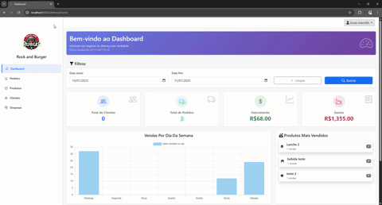

# 🛸 Sistema de Gerenciamento para Delivery, Lanchonetes e Restaurantes

Este sistema foi desenvolvido para facilitar o gerenciamento de estabelecimentos que trabalham com pedidos de delivery ou atendimento local, proporcionando uma visão clara e organizada das vendas, estoque e despesas do negócio.

---

## 🚀 Funcionalidades

- **📦 Controle de Estoque**  
  Registre e acompanhe a quantidade de insumos e produtos disponíveis, evitando faltas e desperdícios.

- **🧾 Lançamento de Pedidos**  
  Registre novos pedidos de forma simples e rápida.

- **💸 Controle de Despesas**  
  Registre gastos do dia a dia e acompanhe o impacto no resultado financeiro.

- **👤 Cadastro de Clientes**  
  Tenha controle dos clientes atendidos, possibilitando histórico e fidelização.

- **📊 Dashboard Gerencial**  
  Visualize os principais indicadores do negócio com base no período selecionado:
    - Total de vendas
    - Total de despesas
    - Número de clientes cadastrados
    - Ranking dos itens mais vendidos com quantidade
    - Gráfico do valor vendido por dia da semana

---
## 📈 Demonstração do Sistema

---

| Tecnologia        | Função                                     |
| ----------------- | ------------------------------------------ |
| **PHP (Laravel)** | Backend e estrutura principal do sistema   |
| **MySQL**         | Banco de dados relacional                  |
| **Docker**        | Padronização e containerização do ambiente |
| **JavaScript**    | Interatividade na interface                |
| **Bootstrap**     | Layout responsivo e estilização            |
